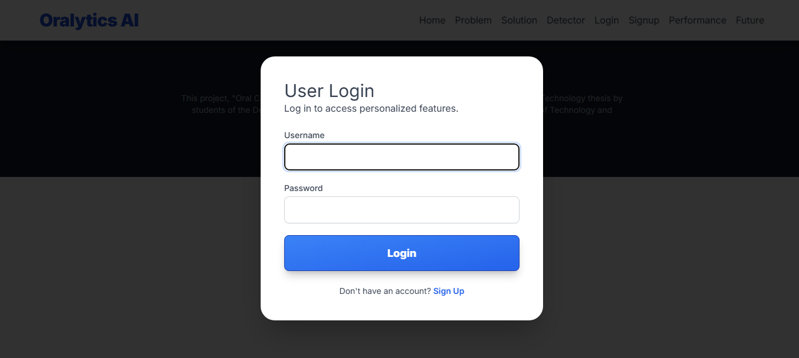
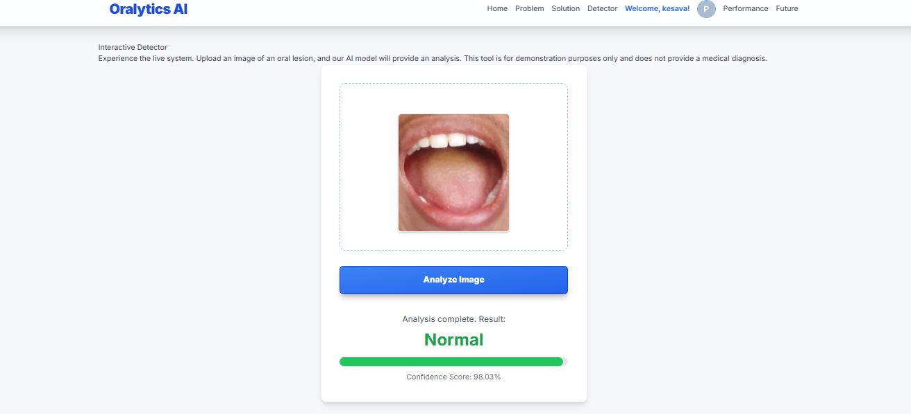

# 🦷 Oral Cancer Detection Using Deep Learning

An AI-powered web application to assist in the **early diagnosis of oral cancer** using **InceptionV3**, a powerful deep learning model. This tool leverages medical imaging and intelligent automation to help healthcare professionals detect oral abnormalities quickly and accurately.

 <!-- Replace with your actual screenshot path -->

---

## 🚀 Project Overview

Oral cancer is a critical health issue often detected late due to manual diagnosis limitations. This project aims to reduce diagnosis time and human error using a deep learning–based detection system. The model processes oral cavity images and predicts whether the input is **Normal** or **Cancerous**.

Developed as part of a Bachelor of Technology thesis (2024–2025) at **Sreenivasa Institute of Technology and Management Studies**, this system integrates:

* 📷 Frontend for user interaction
* 🧠 Backend using Django and TensorFlow
* 🦢 Deep learning with InceptionV3
* 📊 Accuracy, Precision, Recall, F1-Score evaluation

---

## 🏗️ System Architecture

* **Frontend**: HTML, CSS, JavaScript
* **Backend**: Django (Python)
* **Model**: InceptionV3 (Keras/TensorFlow)
* **Database**: SQLite (for user auth and session)
* **Deployment-ready**: Easily hostable on local or cloud environments

```
Frontend ➔ Upload Image ➔ Backend ➔ Preprocessing ➔ InceptionV3 Model ➔ Result
```

---

## ✨ Features

* ✅ Upload and analyze oral cavity images
* 🧠 AI-based cancer detection using InceptionV3
* 🗂 Data preprocessing (resize, normalize, augment)
* 📈 Performance metrics (Accuracy, Precision, Recall, F1-Score)
* 🖼️ Clean and intuitive UI for live predictions
* 🔐 Login/Register functionality
* 🔊 Future-ready: voice input, EHR integration, and multilingual support

---

## 🧪 Technologies Used

| Layer       | Tools                           |
| ----------- | ------------------------------- |
| Frontend    | HTML, CSS, JavaScript           |
| Backend     | Django (Python), SQLite         |
| AI/ML Model | TensorFlow, Keras, InceptionV3  |
| Deployment  | Anaconda, Jupyter Notebook, Git |
| Testing     | Manual + automated test cases   |

---

## 💻 Installation Instructions

### 1. Clone the Repo

```bash
git https://github.com/Kesavareddyc/oral-cancer-detection
cd oral-cancer-detection
```

### 2. Set Up Backend

```bash
cd OralCancerDetectionBackend
python -m venv .venv
.venv\Scripts\activate       # On Windows
pip install -r requirements.txt
python manage.py runserver
```

### 3. Run Frontend

Open `frontend/index.html` in your browser.

---

## 📊 Model Performance

| Metric    | Score |
| --------- | ----- |
| Accuracy  | 98.1% |
| Precision | 96.5% |
| Recall    | 97.3% |
| F1-Score  | 96.9% |

> Confidence Score displayed in live predictions

---

## 📊 Screenshots

### 🔐 Login Page UI



### 🧠 Model Detection UI



---

## 📃 Future Scope

* 📱 Mobile App Development
* 🔊 Voice-assisted, multilingual support
* 💬 Real-time medical chat
* 🗉️ Integration with EHR systems
* 🔄 Dataset expansion and periodic retraining

---

## 📜 Acknowledgements

Developed by:

* C. Kesava Reddy
* A. Jayaprakash
* A. Hemanth Kumar
* B. S. Syed Sab Vali

Under the guidance of **Mr. V.P. Manikandan**, M.Tech (Ph.D), Dept. of CSE, SITAMS.

---

## 📄 License

This project is licensed under the [MIT License](LICENSE).

---

## 📨 Contact

For queries or feedback, reach out via GitHub or connect on [LinkedIn](https://www.linkedin.com/in/keshava-reddy-chintala/).

---

## 🧾 Requirements

Create a requirements.txt file in the OralCancerDetectionBackend/ folder with the following content:
pip install -r requirements.txt